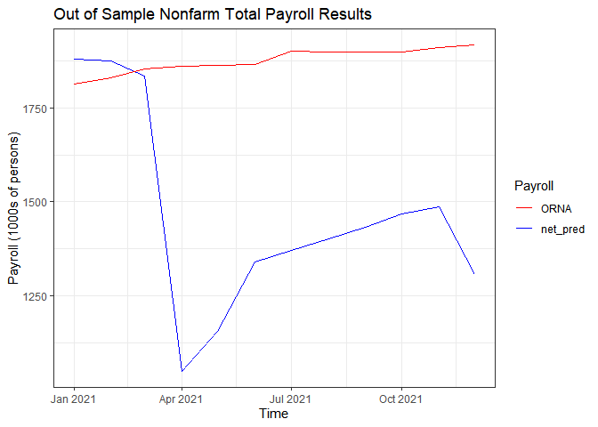
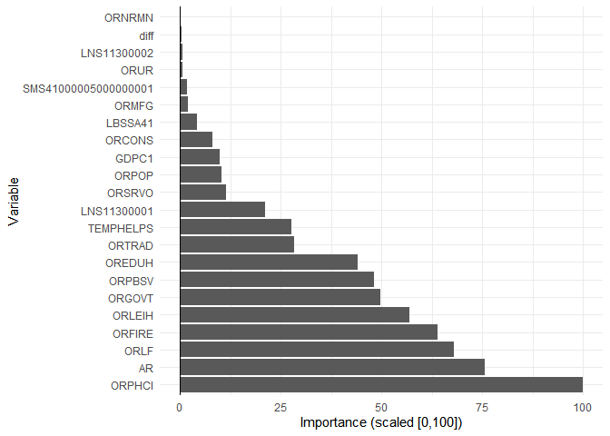
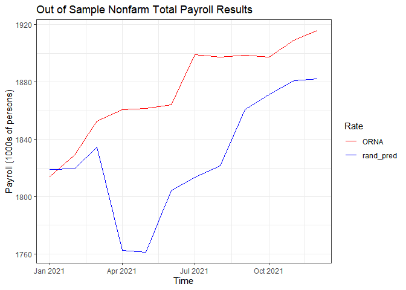
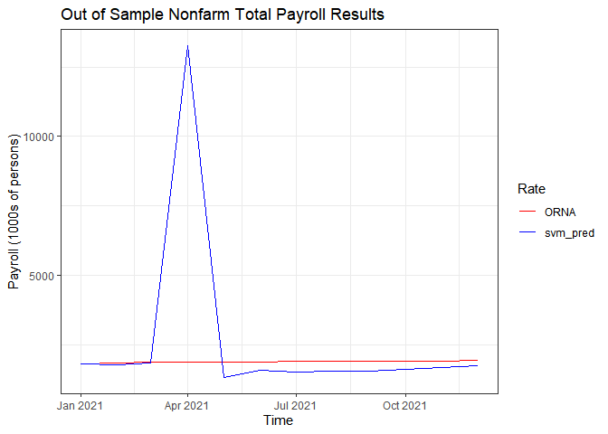
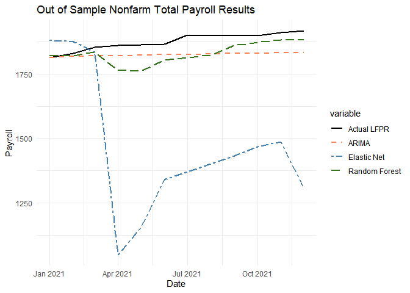
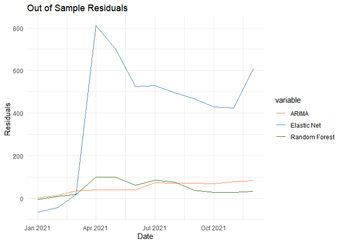
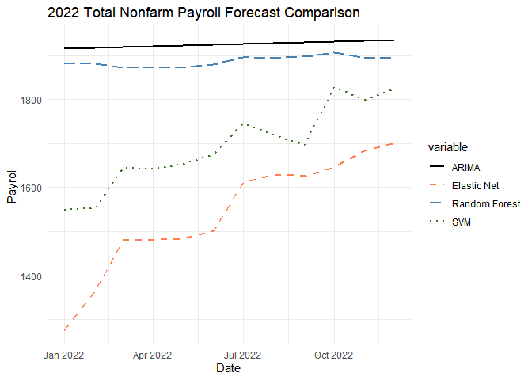

EC522 Final Project, Predicting Oregon’s 2022 Total Nonfarm Payroll
================
Tracy Bishop
Due 3/18/2022

For this project I will be predicting Oregon’s monthly, seasonally
adjusted, total nonfarm payroll in 2022.

FRED ID: ORNA

``` r
############  Output variable ##########
ORNA <- fredr(series_id = "ORNA",
              observation_start = as.Date("1990-01-01"),
              observation_end = as.Date("2021-12-31"))
output_df <- ORNA[,c(1,3)]
output_df <- rename(output_df, ORNA=value)
rm(ORNA)
```

## DATA

GDPC1: National Real GDP, quarterly, billions of chained US dollars

I will include lagged and difference terms of ORNA as predictors. I will
also consider the following FRED series as potential explanatory
variables:

ORPHCI: Coincident Economic Activity, index 2007=100. The Coincident
Economic Activity Index includes four indicators: nonfarm payroll
employment, the unemployment rate, average hours worked in manufacturing
and wages and salaries. The trend for each state’s index is set to match
the trend for gross state product.

LBSSA41: Labor Force Participation rate, %

ORLF: Civilian Labor Force, persons

ORMFG: all employees manufacturing, 1000s of persons

ORCONS: all employees construction, 1000s of persons

ORGOVT: all employees gov, 1000s of persons

SMS41000005000000001: all employees information, 1000s of persons

ORFIRE: all employees financial activities, 1000s of persons

ORSRVO: all employees other services, 1000s of persons

ORLEIH: all employees leisure and hospitality, 1000s of persons

ORNRMN: all employees mining and logging, 1000s of persons

ORPBSV: all employees professional and business services, 1000s of
persons

OREDUH: all employees education and health services, 1000s of persons

ORTRAD: all employees trade, transportation, and utilities, 1000s of
persons

ORUR: Unemployment rate, %

ORPOP: Resident population, 1000s of persons

All the series except for Population and Real Median Household Income
are seasonally adjusted. Population and income are both annual values
and the annual value is assumed to be constant throughout the year.

######################################## 

In addition to the Oregon-specific variables, I included several
national average variables. This is because I thought these variables
might contribute to the predictions but OR-specific data wasn’t easily
available.

LNS11300002: National average of the labor force participation rate for
women

LNS11300001: National average of the labor force participation rate for
men

TEMPHELPS: National average of Temporary Help Services, 1000s of persons

``` r
######## Predictors from FRED 

FRED_series <- data.frame(
  series = c("ORLF",    "ORPHCI",  "ORMFG",   "ORCONS",
             "ORGOVT",  "ORFIRE",  "ORSRVO",  "ORLEIH",   
             "ORNRMN",  "ORPBSV",  "OREDUH",  "ORTRAD",   
             "ORUR",    "LNS11300002","LNS11300001",
             "SMS41000005000000001", "TEMPHELPS", "LBSSA41",
             "ORPOP", 
             "GDPC1"),
  freq   = c("monthly", "monthly",  "monthly",  "monthly",
             "monthly", "monthly",  "monthly",  "monthly",  
             "monthly", "monthly",  "monthly",  "monthly",  
             "monthly", "monthly",  "monthly",  "monthly",
             "monthly", "monthly",
             "annual", 
             "quarterly") )


# function to load FRED series, 
# currently assuming annual and monthly predictors are used
# and that monthly predictions are needed 
input_load_fun = function(series, freq) {
  
  input_df <- fredr(series_id = series,
               observation_start = as.Date("1990-01-01"),
              observation_end = as.Date("2021-12-31"))
  # if frequency is annual, use annual value for each month
  # if frequency is quarterly, use for each month
  # otherwise just pass the monthly value through
  ifelse(freq == "annual" || freq == "quarterly" ,
    input_df <- annual_fun(input_df),
    input_df <- input_df[,c(1,3)] ) 
  
return(input_df)}  # end function


# function to convert annual series to monthly
annual_fun = function(data) {

  # initialize an empty data frame
  df <- data.frame(matrix(ncol = 3, nrow = nrow(output_df)))
  colnames(df) <- c('index', 'date', data[1,2])
  
  for (i in 1:nrow(output_df)) {
    df[i,1] <- findInterval(output_df[i,1],data$date)
    df[i,3] <- data[as.numeric(df[i,1]),3]
  }

  df <- df %>% 
    mutate(date = output_df$date)
  df <- df[,-1]
  
return(df)}  # end function


# call function to load predictors
input_df <- pmap(FRED_series, input_load_fun)
# convert list to df
input_df <- input_df %>% reduce(left_join, by = "date")
# rename columns
colnames(input_df) <- c('date', FRED_series$series)

# combine output and input into a single df
total_df <- merge(output_df, input_df, by = "date")
# and clean up environment
remove(list=c("output_df", "input_df"))
```

Because I am trying to predict outcomes one year into the future I
offset the data by one year. Inputs from 1990 are being used to predict
outcomes in 1991. Inputs from ’91 are being used to predict outcomes in
’92 etc.

I also include the previous year’s value of the outcome variable as as a
predictor as well as the previous year’s month-over-month difference
term.

``` r
# function to create lagged inputs
lagged_fun = function(data, n) {

  # copy 1st two columns (date and dependent variable)
  # and delete beginning rows
  y <- data[-c(1:n), 1:2]

  # create forecast dates
  for (i in 1:n){
    # create forecast dates
    y[nrow(y)+1,1] <- y[nrow(y),1] %m+% months(1)
  }

  #### !!!!! this needs to be generalized !!!!!!!!!!!!!1
  ## rename ORNA in data
  data <- rename(data, AR=ORNA)
    
  # copy predictors
  x <- data[, -c(1)]
  
  # combine y with lagged x's
  output_df <- cbind(y,x)
  
  # create month-over-month diff
  w <- nrow(data)-1
  tmp <- c(NA, output_df[1:w,3])
  output_df <- output_df %>%
    mutate(diff = output_df[,3]- tmp)

#validation_df <- validation_df %>% 
#  mutate(ARIMA_resid = ORNA - ARIMA)
  
return(output_df)}  # end function

# Created the Lagged df
lag_df <- lagged_fun(total_df, 12)
```

## Cleaning

I will reserve data beginning in January 2021 as the validation test set
and only train on data between 1990 - 2020.

``` r
train_df <- lag_df %>% 
  filter(date < "2021-01-01")
test_df <- lag_df %>%
  filter(date >= as.Date("2021-01-01") & date < as.Date("2022-01-01"))
fore_df <- lag_df %>%
  filter(date >= "2022-01-01")
```

Because I used data from FRED not much cleaning is needed. There is one
“NA” in the difference term so I will use mean imputation to fill in
that missing value.

I transformed the labor force, population, and income variables by
taking their natural log.

I normalized all the predictors and used 5-fold cross validation.

``` r
# Define recipe
labor_recipe <- train_df %>% recipe(ORNA ~ .) %>%
  #update role for date variable
  update_role(date, new_role = "date variable") %>%
  #Log relevant variables
  step_mutate(ORLF  = log(ORLF),
              ORPOP = log(ORPOP),
              GDPC1 = log(GDPC1))  %>%
  step_impute_mean(diff) %>%
  step_normalize(all_numeric_predictors())

#Create 5 fold cross validated data frame
sd <- 5688121
set.seed(sd)
train_cv <- train_df %>% vfold_cv(v = 5)
```

# ARIMA Prediction (from RATS)

``` r
# Collect results
validation_df <- data.frame(test_df[,1:2])
validation_df[,3] <- RATS_df[1:12, 2]
validation_df <- rename(validation_df, ARIMA=FORE1)
validation_df <- validation_df %>% 
  mutate(ARIMA_resid = ORNA - ARIMA)

# Collect results
forecast_df <- data.frame(fore_df[,1:2])
forecast_df[,3] <- RATS_df[13:24, 3]
forecast_df <- rename(forecast_df, ARIMA=FORE3)

#calculate the RMSE
rmse_arima <- sqrt(mean(validation_df$ARIMA_resid^2))
```

Now that I have a baseline ARIMA model I’ll see if I can do better by
using some of the machine learning techniques introduced in EC524 I’ll
start with a linear regression that takes all of the predictors and
applies shrinkage coefficients to minimize over-fitting the data.

# Elastic Net

To find the best fit I will simultaneously tune the penalty (shrinkage
coefficient) and the mixture. A mixture of 0 is a ridge regression
meaning that all the predictors are used; the shrinkage coefficient
might shrink the betas to near-zero but they will not reach zero. A
mixture of 1 is lasso regression where some of the betas can be shrunk
all the way to zero. A mixture between 0 and 1 is some combination of
the model types.

``` r
#create lambdas and alphas
lambdas <- 10^seq(from = 5, to = -2, length = 100)
alphas <- seq(from = 0, to = 1, by = 0.1)

#Define a model
net_model <- 
  linear_reg(
  penalty = tune(), mixture = tune()
  ) %>% 
  set_engine("glmnet")

#Define the workflow
net_wf <-
  workflow() %>%
  add_model(net_model) %>%
  add_recipe(labor_recipe)

#find number of cores
all_cores <- parallel::detectCores(logical = FALSE)

#make socket cluster
cl <- makePSOCKcluster(all_cores)

#register the cluster
registerDoParallel(cl, set.seed(sd))

#Tune
net_cv_fit <- 
  net_wf %>% 
  tune_grid(
    train_cv,
    grid = expand_grid(mixture = alphas,
                       penalty = lambdas),
    metrics = metric_set(rmse)
  )

#register the cluster
stopCluster(cl)


#Select the best hyperparameters
best_net <- net_cv_fit %>%
  select_best("rmse")

#Finalize the fit
final_net <-
  net_wf %>%
  finalize_workflow(select_best(net_cv_fit, metric = "rmse"))

#Fit the final model
fitted_final_net <- 
  final_net %>% fit(data = train_df)

#Predict onto the validation set
yhat_net <- fitted_final_net %>% predict(new_data = test_df)

# collect prediction into df
validation_df$net_pred <- yhat_net$.pred
validation_df <- validation_df %>% 
  mutate(net_resid = ORNA - net_pred)

#calculate the RMSE
rmse_net <- sqrt(mean(validation_df$net_resid^2))

# temporary df for ease of plotting
df <- validation_df %>%
  select(date, ORNA, net_pred) %>%
  gather(key = "variable", value = "value", -date)

ggplot(df, aes(x = date, y = value)) + 
  geom_line(aes(color = variable)) + 
  labs(colour = "Payroll")  + 
  scale_color_manual(values = c("ORNA"="red",
                                "net_pred" = "blue")) +
  labs(title="Out of Sample Nonfarm Total Payroll Results",
       y="Payroll (1000s of persons)", x="Time") +
  theme_bw() 
```

<!-- -->

``` r
#Predict onto the forecast set
remove(yhat_net)
yhat_net <- fitted_final_net %>% predict(new_data = fore_df)

# collect prediction into df
forecast_df$net_pred <- yhat_net$.pred

# clean up environment
remove(list=c("df", "yhat_net"))
```

Out of curiosity I used bagged trees to look at the relative importance
of the variables. I didn’t tune this model at all because I know the
trees will be too correlated to give good predictions. This just gives
me a way to look at the relative importance of the predictors.

# Relative importance of predictors

``` r
# look at relative importance of variables

# from class notes:
# grow trees deep and don't prune
# number of trees doesn't usually matter 100 is often ok

# Define workflow
lag_wf <- workflow() %>%
  add_model(bag_tree(
            mode = "regression",
            min_n =  2 )  %>% # end tree  
      set_engine("rpart", times = 100)
  ) %>% # end model
  add_recipe(labor_recipe) 

lag_fit <- lag_wf %>% fit(train_df)
#lag_fit %>% extract_fit_parsnip() %$% fit

imp_df <- lag_fit %>% extract_fit_parsnip() %$% fit %>% var_imp()
# Standardize importance
imp_df %<>% mutate(
  importance = value - min(value),
  importance = 100 * importance / max(importance)
)

# Plot importance
ggplot(
  data = imp_df,
  aes(x = reorder(term, -importance), y = importance)
) +
geom_col() +
geom_hline(yintercept = 0) +
xlab("Variable") +
ylab("Importance (scaled [0,100])") +
theme_minimal() +
theme(legend.position = "none") +
coord_flip()
```

<!-- -->

# Random Forest

``` r
#Define the model 
rand_model <-
  rand_forest(
  mode = "regression",
  engine = "ranger",
  mtry = tune(),
  trees = tune(),
  min_n = tune()
  )

#Define the workflow
rand_wf <-
  workflow() %>%
  add_model(rand_model) %>%
  add_recipe(labor_recipe)

#make socket cluster
cl <- makePSOCKcluster(all_cores)

#register the cluster
registerDoParallel(cl, set.seed(sd))

#Tune
rand_cv <-
  rand_wf %>%
  tune_grid(
    train_cv,
    grid = expand.grid(mtry = c(2, 5, 10, 15),
                       min_n = c(2, 5, 10),
                       trees = c(25, 50, 100, 150, 200, 250, 300)),
    metrics = metric_set(rmse)
  )

#unregister the cluster
stopCluster(cl)

#Find the best mixture
best_rand <- rand_cv %>%
  select_best("rmse")

#Finalize the fit
final_rand <-
  rand_wf %>%
  finalize_workflow(select_best(rand_cv, metric = "rmse"))

#Fit the final model
fitted_final_rand <- 
  final_rand %>% fit(data = train_df)
#train_clean

#Predict onto the test data
yhat_rand <- fitted_final_rand %>% predict(new_data = test_df)

# collect prediction into df
validation_df$rand_pred <- yhat_rand$.pred
validation_df <- validation_df %>% 
  mutate(rand_resid = ORNA - rand_pred)

#calculate the RMSE
rmse_rand <- sqrt(mean(validation_df$rand_resid^2))

#Predict onto the fore data
remove(yhat_rand)
yhat_rand <- fitted_final_rand %>% predict(new_data = fore_df)

# collect prediction into df
forecast_df$rand_pred <- yhat_rand$.pred


# temporary df for ease of plotting
df <- validation_df %>%
  select(date, ORNA, rand_pred) %>%
  gather(key = "variable", value = "value", -date)

ggplot(df, aes(x = date, y = value)) + 
  geom_line(aes(color = variable)) + 
  labs(colour = "Rate")  + 
  scale_color_manual(values = c("ORNA"="red",
                                "rand_pred" = "blue")) +
  labs(title="Out of Sample Nonfarm Total Payroll Results",
       y="Payroll (1000s of persons)", x="Time") +
  theme_bw() 
```

<!-- -->

``` r
# clean up environment
remove(list=c("df", "yhat_rand"))
```

# Support Vector Machine (SVM)

``` r
#Define the SVM model
svm_model <- svm_poly(
  mode = "regression",
  cost = tune(),
  degree = tune()
) %>% set_engine("kernlab")

#Define the workflow
svm_wf <- workflow() %>%
  add_model(svm_model) %>%
  add_recipe(labor_recipe)

#make socket cluster
cl <- makePSOCKcluster(all_cores)

#register cluster
registerDoParallel(cl, set.seed(sd))


#Tune the SVM model
svm_tune <- tune_grid(
  svm_wf,
  train_cv,
  grid = expand_grid(
    cost = 10^seq(-4, 2, length = 10),
    degree = 1:3
  ),
  metrics = metric_set(rmse)
)

#register the cluster
stopCluster(cl)

#select the best mixture
best_svm <- svm_tune %>%
  select_best("rmse")


#Finalize the fit
final_svm <-
  svm_wf %>%
  finalize_workflow(select_best(svm_tune, metric = "rmse"))

#Fit the final model
fitted_final_svm <- 
  final_svm %>% fit(data = train_df)

#Predict onto the test data
yhat_svm <- fitted_final_svm %>% predict(new_data = test_df)

# collect prediction into df
validation_df$svm_pred <- yhat_svm$.pred
validation_df <- validation_df %>% 
  mutate(svm_resid = ORNA - svm_pred)


#Predict onto the fore data
yhat_svm <- fitted_final_svm %>% predict(new_data = fore_df)

# collect prediction into df
forecast_df$svm_pred <- yhat_svm$.pred

#calculate the RMSE
rmse_svm <- sqrt(mean(validation_df$svm_resid^2))

# temporary df for ease of plotting
df <- validation_df %>%
  select(date, ORNA, svm_pred) %>%
  gather(key = "variable", value = "value", -date)

ggplot(df, aes(x = date, y = value)) + 
  geom_line(aes(color = variable)) + 
  labs(colour = "Rate")  + 
  scale_color_manual(values = c("ORNA"="red",
                                "svm_pred" = "blue")) +
  labs(title="Out of Sample Nonfarm Total Payroll Results",
       y="Payroll (1000s of persons)", x="Time") +
  theme_bw() 
```

<!-- -->

``` r
# clean up environment
remove(list=c("df", "yhat_svm"))
```

# Summarizing the test Predictions

less SVM because it’s so far off

``` r
#Convert to ordinal dataframe 
df_pred <- validation_df %>%
  mutate(`Actual LFPR` = ORNA,
         ARIMA = ARIMA,
         `Elastic Net` = net_pred,
         `Random Forest` = rand_pred)
df_pred %<>% 
  select(date, `Actual LFPR`, ARIMA, `Elastic Net`, `Random Forest`) %>% 
  gather(key = "variable", value = "value", -date) 

#graph
theme_set(theme_minimal())
ggplot(df_pred, aes(x = date, y = value, color = variable, linetype = variable)) +
  geom_line(size = 1) +
  scale_color_manual(values = c("black", "coral", "steelblue", "#38761d", "#C77CFF")) +
  scale_linetype_manual(values = c("solid", "dashed", "twodash", "longdash", "dotted")) +
  labs(y = "Payroll", x = "Date") +
  ggtitle("Out of Sample Nonfarm Total Payroll Results") +
  labs(color = "variable", linetype = "variable") 
```

<!-- -->
<br> The graph above is a visualization of actual payroll in 2021 and
each model’s predicted value.

# Summarizing average RMSE

``` r
#temporary df for plotting 
df_res <- validation_df %>%
  mutate(ARIMA = ARIMA_resid,
         `Elastic Net` = net_resid,
         `Random Forest` = rand_resid)
df_res %<>% 
  select(date, ARIMA, `Elastic Net`, `Random Forest`) %>% 
  gather(key = "variable", value = "value", -date) 


#graph
theme_set(theme_minimal())
ggplot(df_res, aes(x = date, y = value, color = variable)) +
  geom_line() +
  scale_color_manual(values = c("coral", "steelblue", "#38761d", "#C77CFF")) +
  scale_linetype_manual(values = c("dashed", "twodash", "longdash", "dotted")) +
  labs(y = "Residuals", x = "Date") +
  ggtitle("Out of Sample Residuals")
```

<!-- -->

Average Out of Sample RMSE Values

``` r
#create date frame
rmse_df <- data.frame(Model = c("ARIMA", "Elastic Net", "Random Forest", "SVM"),
  RMSE = c(rmse_arima, rmse_net, rmse_rand, rmse_svm)
)

rmse_df %>%
  gt() %>%
  tab_header(
    title = "Out of Sample Root Mean Squared Error by Model"
  )
```

<div id="cpijqrmzju" style="overflow-x:auto;overflow-y:auto;width:auto;height:auto;">
<style>html {
  font-family: -apple-system, BlinkMacSystemFont, 'Segoe UI', Roboto, Oxygen, Ubuntu, Cantarell, 'Helvetica Neue', 'Fira Sans', 'Droid Sans', Arial, sans-serif;
}

#cpijqrmzju .gt_table {
  display: table;
  border-collapse: collapse;
  margin-left: auto;
  margin-right: auto;
  color: #333333;
  font-size: 16px;
  font-weight: normal;
  font-style: normal;
  background-color: #FFFFFF;
  width: auto;
  border-top-style: solid;
  border-top-width: 2px;
  border-top-color: #A8A8A8;
  border-right-style: none;
  border-right-width: 2px;
  border-right-color: #D3D3D3;
  border-bottom-style: solid;
  border-bottom-width: 2px;
  border-bottom-color: #A8A8A8;
  border-left-style: none;
  border-left-width: 2px;
  border-left-color: #D3D3D3;
}

#cpijqrmzju .gt_heading {
  background-color: #FFFFFF;
  text-align: center;
  border-bottom-color: #FFFFFF;
  border-left-style: none;
  border-left-width: 1px;
  border-left-color: #D3D3D3;
  border-right-style: none;
  border-right-width: 1px;
  border-right-color: #D3D3D3;
}

#cpijqrmzju .gt_title {
  color: #333333;
  font-size: 125%;
  font-weight: initial;
  padding-top: 4px;
  padding-bottom: 4px;
  padding-left: 5px;
  padding-right: 5px;
  border-bottom-color: #FFFFFF;
  border-bottom-width: 0;
}

#cpijqrmzju .gt_subtitle {
  color: #333333;
  font-size: 85%;
  font-weight: initial;
  padding-top: 0;
  padding-bottom: 6px;
  padding-left: 5px;
  padding-right: 5px;
  border-top-color: #FFFFFF;
  border-top-width: 0;
}

#cpijqrmzju .gt_bottom_border {
  border-bottom-style: solid;
  border-bottom-width: 2px;
  border-bottom-color: #D3D3D3;
}

#cpijqrmzju .gt_col_headings {
  border-top-style: solid;
  border-top-width: 2px;
  border-top-color: #D3D3D3;
  border-bottom-style: solid;
  border-bottom-width: 2px;
  border-bottom-color: #D3D3D3;
  border-left-style: none;
  border-left-width: 1px;
  border-left-color: #D3D3D3;
  border-right-style: none;
  border-right-width: 1px;
  border-right-color: #D3D3D3;
}

#cpijqrmzju .gt_col_heading {
  color: #333333;
  background-color: #FFFFFF;
  font-size: 100%;
  font-weight: normal;
  text-transform: inherit;
  border-left-style: none;
  border-left-width: 1px;
  border-left-color: #D3D3D3;
  border-right-style: none;
  border-right-width: 1px;
  border-right-color: #D3D3D3;
  vertical-align: bottom;
  padding-top: 5px;
  padding-bottom: 6px;
  padding-left: 5px;
  padding-right: 5px;
  overflow-x: hidden;
}

#cpijqrmzju .gt_column_spanner_outer {
  color: #333333;
  background-color: #FFFFFF;
  font-size: 100%;
  font-weight: normal;
  text-transform: inherit;
  padding-top: 0;
  padding-bottom: 0;
  padding-left: 4px;
  padding-right: 4px;
}

#cpijqrmzju .gt_column_spanner_outer:first-child {
  padding-left: 0;
}

#cpijqrmzju .gt_column_spanner_outer:last-child {
  padding-right: 0;
}

#cpijqrmzju .gt_column_spanner {
  border-bottom-style: solid;
  border-bottom-width: 2px;
  border-bottom-color: #D3D3D3;
  vertical-align: bottom;
  padding-top: 5px;
  padding-bottom: 5px;
  overflow-x: hidden;
  display: inline-block;
  width: 100%;
}

#cpijqrmzju .gt_group_heading {
  padding-top: 8px;
  padding-bottom: 8px;
  padding-left: 5px;
  padding-right: 5px;
  color: #333333;
  background-color: #FFFFFF;
  font-size: 100%;
  font-weight: initial;
  text-transform: inherit;
  border-top-style: solid;
  border-top-width: 2px;
  border-top-color: #D3D3D3;
  border-bottom-style: solid;
  border-bottom-width: 2px;
  border-bottom-color: #D3D3D3;
  border-left-style: none;
  border-left-width: 1px;
  border-left-color: #D3D3D3;
  border-right-style: none;
  border-right-width: 1px;
  border-right-color: #D3D3D3;
  vertical-align: middle;
}

#cpijqrmzju .gt_empty_group_heading {
  padding: 0.5px;
  color: #333333;
  background-color: #FFFFFF;
  font-size: 100%;
  font-weight: initial;
  border-top-style: solid;
  border-top-width: 2px;
  border-top-color: #D3D3D3;
  border-bottom-style: solid;
  border-bottom-width: 2px;
  border-bottom-color: #D3D3D3;
  vertical-align: middle;
}

#cpijqrmzju .gt_from_md > :first-child {
  margin-top: 0;
}

#cpijqrmzju .gt_from_md > :last-child {
  margin-bottom: 0;
}

#cpijqrmzju .gt_row {
  padding-top: 8px;
  padding-bottom: 8px;
  padding-left: 5px;
  padding-right: 5px;
  margin: 10px;
  border-top-style: solid;
  border-top-width: 1px;
  border-top-color: #D3D3D3;
  border-left-style: none;
  border-left-width: 1px;
  border-left-color: #D3D3D3;
  border-right-style: none;
  border-right-width: 1px;
  border-right-color: #D3D3D3;
  vertical-align: middle;
  overflow-x: hidden;
}

#cpijqrmzju .gt_stub {
  color: #333333;
  background-color: #FFFFFF;
  font-size: 100%;
  font-weight: initial;
  text-transform: inherit;
  border-right-style: solid;
  border-right-width: 2px;
  border-right-color: #D3D3D3;
  padding-left: 5px;
  padding-right: 5px;
}

#cpijqrmzju .gt_stub_row_group {
  color: #333333;
  background-color: #FFFFFF;
  font-size: 100%;
  font-weight: initial;
  text-transform: inherit;
  border-right-style: solid;
  border-right-width: 2px;
  border-right-color: #D3D3D3;
  padding-left: 5px;
  padding-right: 5px;
  vertical-align: top;
}

#cpijqrmzju .gt_row_group_first td {
  border-top-width: 2px;
}

#cpijqrmzju .gt_summary_row {
  color: #333333;
  background-color: #FFFFFF;
  text-transform: inherit;
  padding-top: 8px;
  padding-bottom: 8px;
  padding-left: 5px;
  padding-right: 5px;
}

#cpijqrmzju .gt_first_summary_row {
  border-top-style: solid;
  border-top-color: #D3D3D3;
}

#cpijqrmzju .gt_first_summary_row.thick {
  border-top-width: 2px;
}

#cpijqrmzju .gt_last_summary_row {
  padding-top: 8px;
  padding-bottom: 8px;
  padding-left: 5px;
  padding-right: 5px;
  border-bottom-style: solid;
  border-bottom-width: 2px;
  border-bottom-color: #D3D3D3;
}

#cpijqrmzju .gt_grand_summary_row {
  color: #333333;
  background-color: #FFFFFF;
  text-transform: inherit;
  padding-top: 8px;
  padding-bottom: 8px;
  padding-left: 5px;
  padding-right: 5px;
}

#cpijqrmzju .gt_first_grand_summary_row {
  padding-top: 8px;
  padding-bottom: 8px;
  padding-left: 5px;
  padding-right: 5px;
  border-top-style: double;
  border-top-width: 6px;
  border-top-color: #D3D3D3;
}

#cpijqrmzju .gt_striped {
  background-color: rgba(128, 128, 128, 0.05);
}

#cpijqrmzju .gt_table_body {
  border-top-style: solid;
  border-top-width: 2px;
  border-top-color: #D3D3D3;
  border-bottom-style: solid;
  border-bottom-width: 2px;
  border-bottom-color: #D3D3D3;
}

#cpijqrmzju .gt_footnotes {
  color: #333333;
  background-color: #FFFFFF;
  border-bottom-style: none;
  border-bottom-width: 2px;
  border-bottom-color: #D3D3D3;
  border-left-style: none;
  border-left-width: 2px;
  border-left-color: #D3D3D3;
  border-right-style: none;
  border-right-width: 2px;
  border-right-color: #D3D3D3;
}

#cpijqrmzju .gt_footnote {
  margin: 0px;
  font-size: 90%;
  padding-left: 4px;
  padding-right: 4px;
  padding-left: 5px;
  padding-right: 5px;
}

#cpijqrmzju .gt_sourcenotes {
  color: #333333;
  background-color: #FFFFFF;
  border-bottom-style: none;
  border-bottom-width: 2px;
  border-bottom-color: #D3D3D3;
  border-left-style: none;
  border-left-width: 2px;
  border-left-color: #D3D3D3;
  border-right-style: none;
  border-right-width: 2px;
  border-right-color: #D3D3D3;
}

#cpijqrmzju .gt_sourcenote {
  font-size: 90%;
  padding-top: 4px;
  padding-bottom: 4px;
  padding-left: 5px;
  padding-right: 5px;
}

#cpijqrmzju .gt_left {
  text-align: left;
}

#cpijqrmzju .gt_center {
  text-align: center;
}

#cpijqrmzju .gt_right {
  text-align: right;
  font-variant-numeric: tabular-nums;
}

#cpijqrmzju .gt_font_normal {
  font-weight: normal;
}

#cpijqrmzju .gt_font_bold {
  font-weight: bold;
}

#cpijqrmzju .gt_font_italic {
  font-style: italic;
}

#cpijqrmzju .gt_super {
  font-size: 65%;
}

#cpijqrmzju .gt_two_val_uncert {
  display: inline-block;
  line-height: 1em;
  text-align: right;
  font-size: 60%;
  vertical-align: -0.25em;
  margin-left: 0.1em;
}

#cpijqrmzju .gt_footnote_marks {
  font-style: italic;
  font-weight: normal;
  font-size: 75%;
  vertical-align: 0.4em;
}

#cpijqrmzju .gt_asterisk {
  font-size: 100%;
  vertical-align: 0;
}

#cpijqrmzju .gt_slash_mark {
  font-size: 0.7em;
  line-height: 0.7em;
  vertical-align: 0.15em;
}

#cpijqrmzju .gt_fraction_numerator {
  font-size: 0.6em;
  line-height: 0.6em;
  vertical-align: 0.45em;
}

#cpijqrmzju .gt_fraction_denominator {
  font-size: 0.6em;
  line-height: 0.6em;
  vertical-align: -0.05em;
}
</style>
<table class="gt_table">
  <thead class="gt_header">
    <tr>
      <th colspan="2" class="gt_heading gt_title gt_font_normal gt_bottom_border" style>Out of Sample Root Mean Squared Error by Model</th>
    </tr>
    
  </thead>
  <thead class="gt_col_headings">
    <tr>
      <th class="gt_col_heading gt_columns_bottom_border gt_left" rowspan="1" colspan="1">Model</th>
      <th class="gt_col_heading gt_columns_bottom_border gt_right" rowspan="1" colspan="1">RMSE</th>
    </tr>
  </thead>
  <tbody class="gt_table_body">
    <tr><td class="gt_row gt_left">ARIMA</td>
<td class="gt_row gt_right">57.06877</td></tr>
    <tr><td class="gt_row gt_left">Elastic Net</td>
<td class="gt_row gt_right">492.40558</td></tr>
    <tr><td class="gt_row gt_left">Random Forest</td>
<td class="gt_row gt_right">58.34313</td></tr>
    <tr><td class="gt_row gt_left">SVM</td>
<td class="gt_row gt_right">3302.83778</td></tr>
  </tbody>
  
  
</table>
</div>

<br>

# Summarizing 2022 Predictions

``` r
#Convert to ordinal dataframe 
df_pred <- forecast_df %>%
  mutate( ARIMA = ARIMA,
         `Elastic Net` = net_pred,
         `Random Forest` = rand_pred,
         SVM = svm_pred)
df_pred %<>% 
  select(date, ARIMA, `Elastic Net`, `Random Forest`, SVM) %>% 
  gather(key = "variable", value = "value", -date) 

#graph
theme_set(theme_minimal())
ggplot(df_pred, aes(x = date, y = value, color = variable, linetype = variable)) +
  geom_line(size = 1) +
  scale_color_manual(values = c("black", "coral", "steelblue", "#38761d")) +
  scale_linetype_manual(values = c("solid", "dashed", "longdash", "dotted")) +
  labs(y = "Payroll", x = "Date") +
  ggtitle("2022 Total Nonfarm Payroll Forecast Comparison") +
  labs(color = "variable", linetype = "variable") 
```

<!-- -->
<br> <br> <br> <br>
